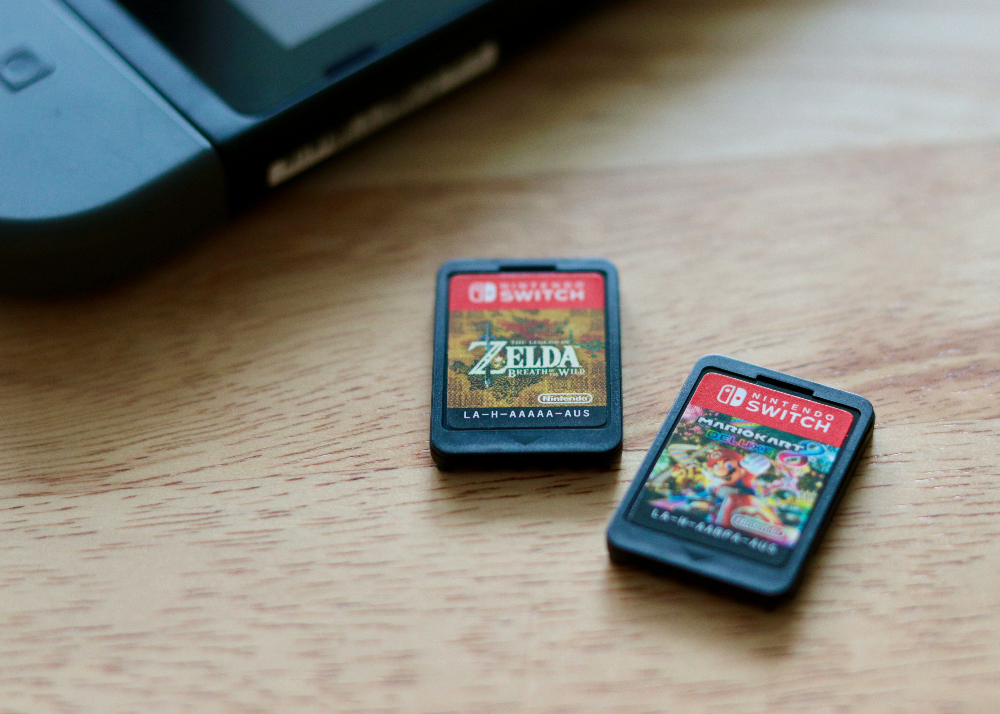

# Yet Another NSW Library Manager

Бот для управления личной библиотекой игр на Nintendo Switch с возможностью посмотреть, у кого ещё есть такая же игра. 



[Jacob Spaccavento](https://unsplash.com/@sp_cca?utm_content=creditCopyText&utm_medium=referral&utm_source=unsplash), [Unsplash](https://unsplash.com/photos/a-couple-of-nintendo-games-sitting-on-top-of-a-wooden-table-BaVfcEowKqw?utm_content=creditCopyText&utm_medium=referral&utm_source=unsplash).

## Функциональные возможности

Вот такие полезные штуки у меня будут:

* [ ] Добавление информации о своих играх: название, стоимость;
* [ ] Получение информации об играх из eShop: текущая стоимость, рейтинг, описание;
* [ ] Добавление отзывов на купленные игры с оценкой;
* [ ] Просмотр пользователей с похожей библиотекой.

## Список команд

| Команда  | Описание                                |
|----------|-----------------------------------------|
| `/start` | Приветствие бота                        |
| `/help`  | Описание основных возможностей и команд |
| `/add`   | Добавление новой игры в свой список     |
| `/find`  | Поиск игр по параметрам                 |

## Проектирование

Игра:

* Название
* ID игры в eShop
* Текущая стоимость
* Возрастной рейтинг
* Общий пользовательский рейтинг
* Описание
* Добавить игру
* Оценить игру
* Посмотреть информацию об игре
* Изменить стоимость покупки игры

Купленная игра:

* Игра, которую купили
* Пользователь, который купил игру
* Стоимость покупки

Пользователь:

* ID в Телеграме
* Никнейм в eShop
* Список купленных игр (библиотека)
* Зарегистрировать пользователя
* Найти похожих пользователей
* Посмотреть список купленных игр

Отзыв:

* Игра, на которую оставлен отзыв
* Пользователь, оставивший отзыв
* Текст отзыва
* Оценка игры

## Пример кода

```python
def add(a, b):
    return a + b


print(add(5, 8))
```

## Красивая формула

Все мы знаем знаменитое уравнение Эйнштейна $e = mc^2$.

$$
y = \sin(\lg{x})
$$
